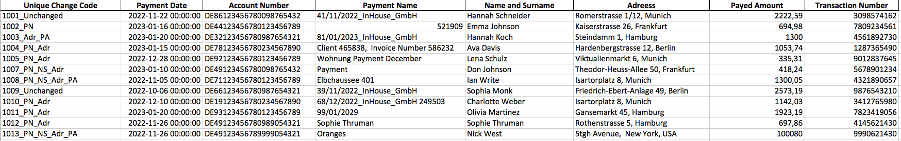
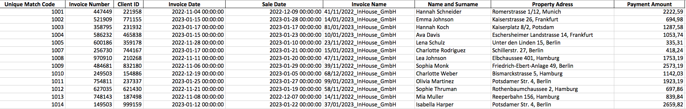

# Payments Matcher Pro
This project is a Python script for matching bank payments to the invoice list (in this case property rental Invoice List), using various matching strategies. It reads payment and invoice data from CSV files and outputs the matched results in new CSV files.
These are the potential scenarios considered in the code:

**Scenarios in the code:**  

Payment ACCEPTED  
    1. Payment amount is correct and Invoice Number, Client ID or the number in Invoice Name is included in the Payment 

Payment TO BE CHECKED  
    2. Payment amount is incorrect and Invoice Number, Client ID or the number in Invoice Name is included in the Payment

Payment ACCEPTED  
    3. Payment amount is correct and Name and a Surname on the incoming Payment and the Invoice list are the same 

Payment ACCEPTED  
    4. Payment amount is correct and there is similarity of the Adress in the Payment Name and the Property Adress

Payment TO BE CHECKED  
    5. Payment amount is incorrect and there is similarity of the Adress in the Payment Name and the Property Adress

Payment TO BE CHECKED  
    6. Only payment amount is the same as one unassigned in the database

Payment TO BE CHECKED  
    7. Not any information from the payments, matches with any other information in the database  

## Python Bank Payments and Invoices Matching

This project is a Python script for matching bank payments to property invoices using various matching strategies. It reads payment and invoice data from CSV files and outputs the matched results in new CSV files.

## Dependencies

- pandas
- jellyfish

## Installation

1. Clone the repository.
2. Install the required dependencies:
3. pip install pandas jellyfish
# Payments Matcher Pro
This project is a Python script for matching bank payments to the invoice list (in this case property rental Invoice List), using various matching strategies. It reads payment and invoice data from CSV files and outputs the matched results in new CSV files.
These are the potential scenarios considered in the code:

**Scenarios in the code:**  

Payment ACCEPTED  
    1. Payment amount is correct and Invoice Number, Client ID or the number in Invoice Name is included in the Payment 

Payment TO BE CHECKED  
    2. Payment amount is incorrect and Invoice Number, Client ID or the number in Invoice Name is included in the Payment

Payment ACCEPTED  
    3. Payment amount is correct and Name and a Surname on the incoming Payment and the Invoice list are the same 

Payment ACCEPTED  
    4. Payment amount is correct and there is similarity of the Adress in the Payment Name and the Property Adress

Payment TO BE CHECKED  
    5. Payment amount is incorrect and there is similarity of the Adress in the Payment Name and the Property Adress

Payment TO BE CHECKED  
    6. Only payment amount is the same as one unassigned in the database

Payment TO BE CHECKED  
    7. Not any information from the payments, matches with any other information in the database  

## Python Bank Payments and Invoices Matching

This project is a Python script for matching bank payments to property invoices using various matching strategies. 
It reads payment and invoice data from CSV files and outputs the matched results in new CSV files.

## Dependencies

- pandas
- jellyfish

## Installation

1. Clone the repository.
2. Install the required dependencies:
3. pip install pandas jellyfish

## Usage

1. Place your payment and invoice .csv datasets in the Datasets folder.

3. Run the script:
4. python matching_algorithms.py
5. Check the output files in the Datasets folder for the matched results (matched_invoices.csv and merged_payments.csv files) 

## Usage

1. Place your payment and invoice datasets in the Datasets folder.
2. Run the script:
3. python matching_algorithms.py
4. Check the output files in the Datasets folder for the matched results.
